Intel (R) Aero Platform supports both PX4 and ArduPilot autopilots.
Aero Flight Controller ships by default with PX4 firmware.

Specific documentation for each of the supported autopilots:

* PX4:
    * https://docs.px4.io/en/flying/

* ArduPilot:
    * http://ardupilot.org/copter/docs/flying-arducopter.html
    * http://ardupilot.org/copter/docs/common-intel-aero-rtf.html

## Calibration

!!! warning
    Calibration must be done when flight controller is changed/updated

The sensors used by the Flight Controller to stabilize the drone need to be calibrated before being ready to fly. This is already done on factory for the RTF, but when it is updated a new calibration may be needed and is **strongly advised**.

The recommended Ground Control Station (GCS) is QGroundControl (QGC). If you are using the ArduPilot flight stack another commonly used GCS is MissionPlanner, however this is not being covered here. Refer to [its own documentation](http://ardupilot.org/planner/).

!!! warning
    The following steps require connection to the RTF drone. If you do not have a connection stabilished yet, please refer to the [Connecting](connecting/) section.

Open up QGroundControl and ensure the GPS and Battery are active **colored black** and have basic functionality in the top panel:

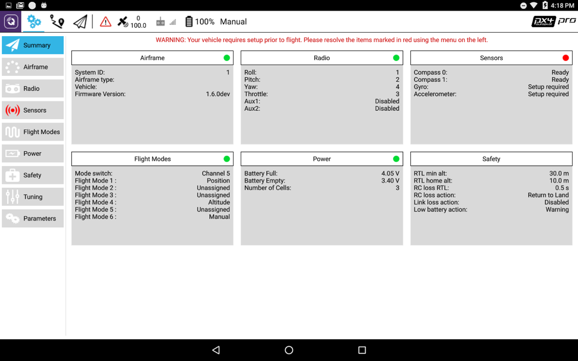

Navigate to the Airframe menu and select **Reset** to reset the drone’s airframe configuration. Select **Apply and Restart**.

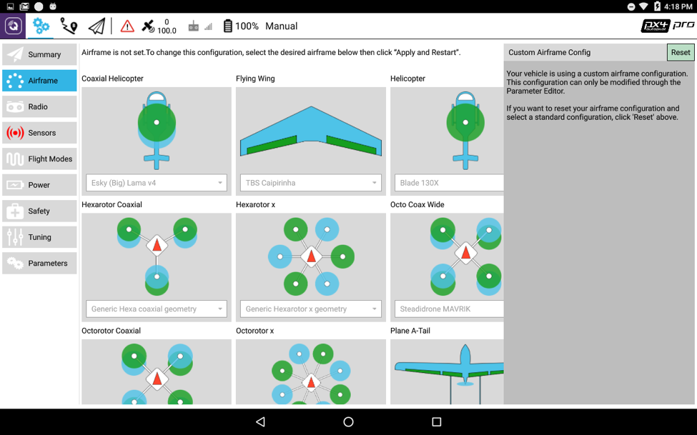

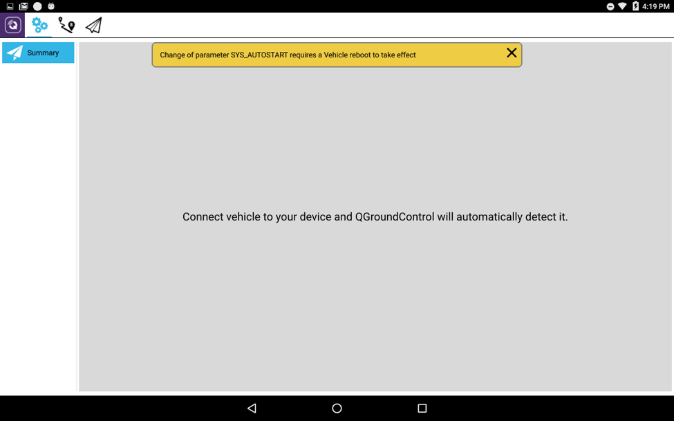

Wait for the connection to be reestablished. Throughout the calibration process we want to ensure all sensors and needed parts are calibrated. A red dot in a section indicates an area that may need attention and still has steps to complete. In the summary screen it's possible to see specific details about what still needs to be calibrated or configured. Belo we are going through each of them.

### Binding the transmitter

Press the Bind button on the Spektrum Transmitter while turning it on and ensure a series of 3 fast continuous fast beeps are heard.

### RC

On QGroundControl, navigate to the Radio menu and select **Calibrate**.

Follow the instructions to calibrate the transmitter, selecting **Next** after each change. The images below refer to the PX4 calibration steps, but similar ones are done for ArduPilot.

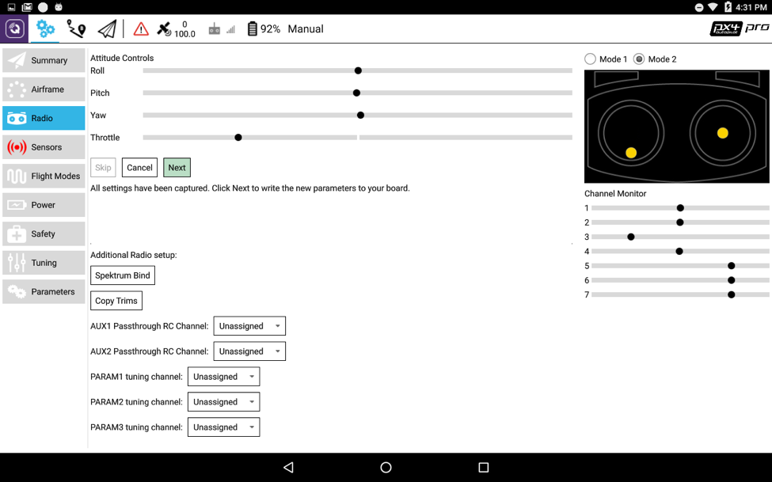

### Sensor calibration

Navigate to the Sensors menu. Select **Ok** to start the sensor calibration process

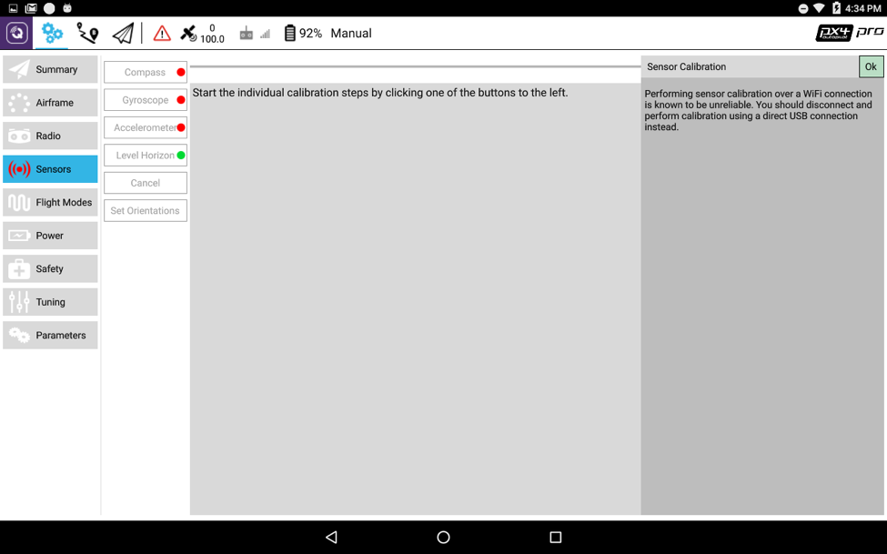

Select Compass menu and press **Ok** to start the calibration process

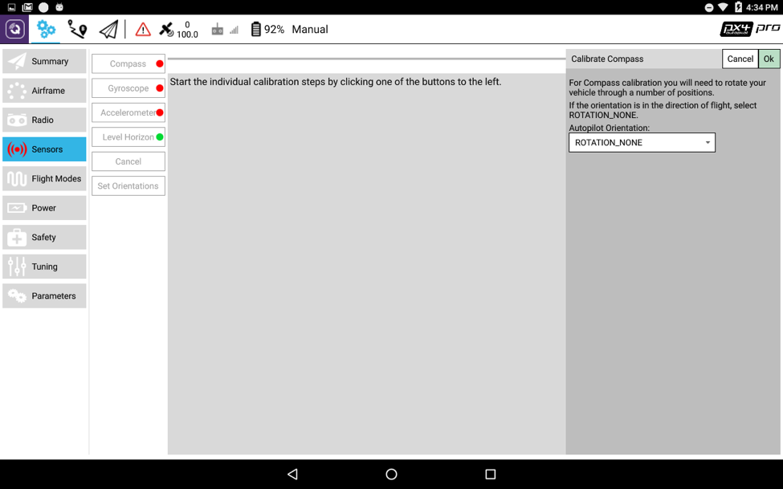

Position then rotate the drone as indicated in each of the 6 figures

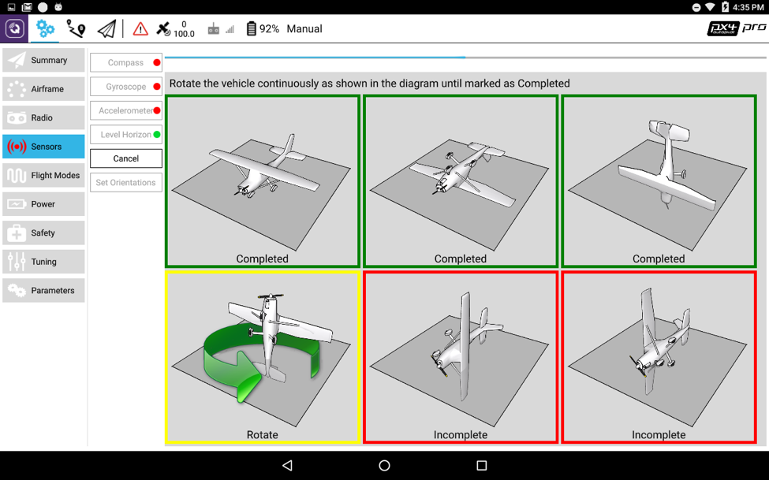

On PX4 also calibrate the Gyroscope. Select the Gyroscope menu item and it will start automatically. Wait until it completes

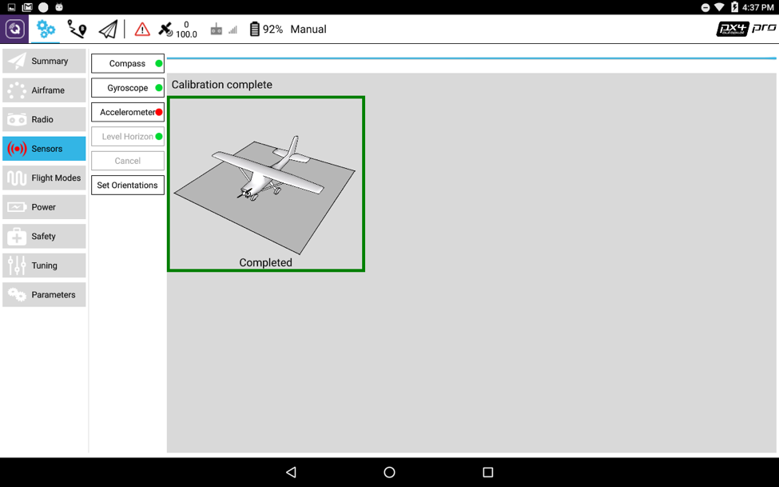

Select Accelerometer menu. Position the drone in each of the positions until each of the 6 are marked as green and **Completed**

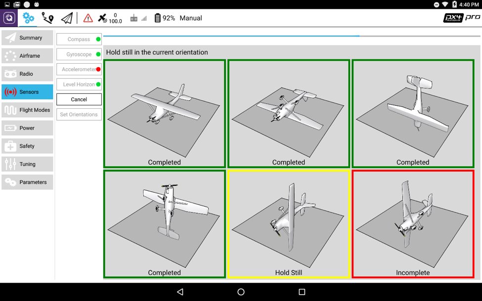

Select the Level Horizon menu and select **Ok**. The calibration will start and stop automatically

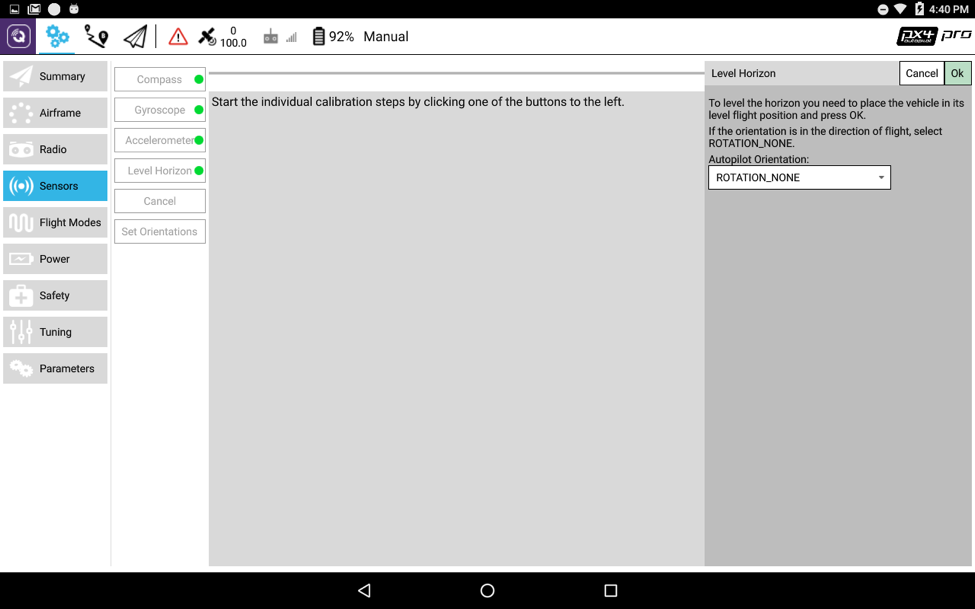

Navigate to Flight Modes and check the configuration. By default the following is configured:

* Flight Mode 1 – Position
* Flight Mode 4 – Altitude
* Flight Mode 5 – Stabilized

You may want to change the modes as you experiment them. Make sure to read the documentation about each of them on the respective flight stack: using a wrong mode or one that you don't know how it works is very dangerous.

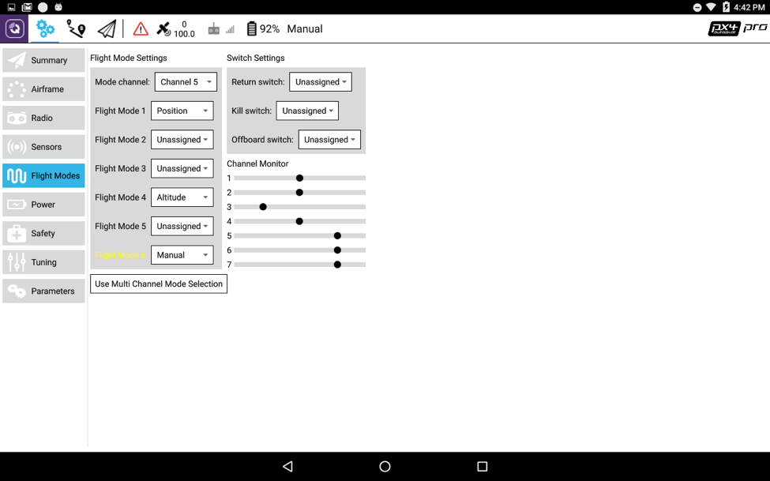

When this procedure is finished, you should be able to get data in QGC from the drone (ex: GPS coordinates) but also act on the drone (ex: ARM motors, without propellers first).

## First flight

1. Read the __Terms & Conditions of Use and Important Safety Information__ document (included in the box) before
operating the drone.

2. Experienced pilots can begin flying immediately after following these steps:
    1. Attach a Battery
        1. Insert a battery inside the center cavity of the drone’s airframe with cables extending out toward the
rear of the drone as shown in Figure 1.
        2. Tighten the restraining strap around the battery to secure the battery as close to the center of the
airframe as possible.
        3. Connect the battery cable to the drone using the XT60 connector

        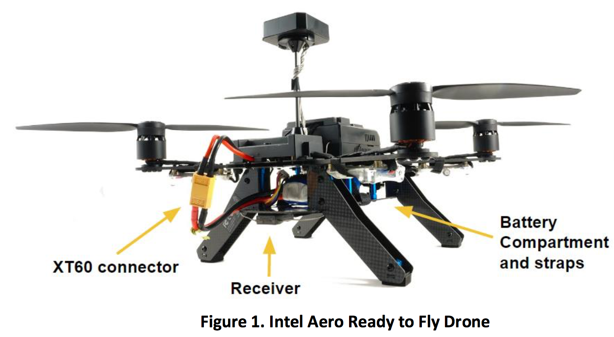

    2. Set up the GPS Antenna (see Figure 2) : Raise the GPS antenna mast 90o until vertical then tighten the antenna base cover

      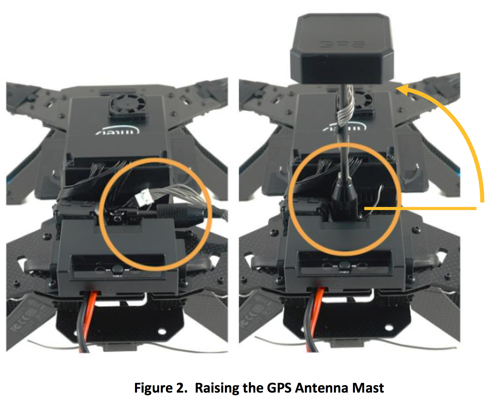

    3. Attach the propellers (see Figure 3)
        1. Identify propellers marked as “A” and “B” on top of the propeller blade.
        2. Attach each propeller to its corresponding labeled motor by pressing down and twisting __counter-clockwise__ (for “A” propellers) and __clockwise__ (for “B” propellers) until each propeller latches securely.
        3. To detach the propeller, press the center hub of the propeller while twisting the propeller blade in the opposite direction used when attaching.

         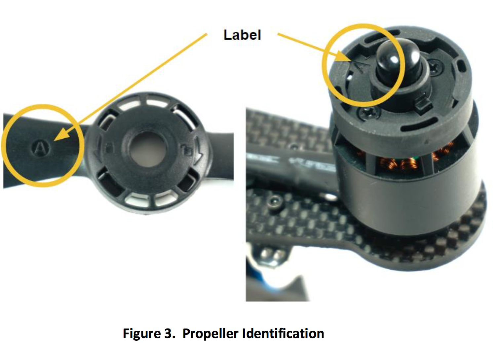

    4. Prepare the remote control transmitter (see Figure 4)
        1. Install the 4 AA alkaline batteries in the transmitter.
        2. Flip all toggle switches UP or AWAY from the pilot. The Flight Mode switch should be set to __Stabilized__ (mode 0) until you arm the motors in Step 3.iv.
        3. Turn ON the transmitter by sliding its power switch UP (located between the two gimbal sticks) The transmitter’s power LED will turn to steady orange and a two-tone “rising chirp” will be heard.

         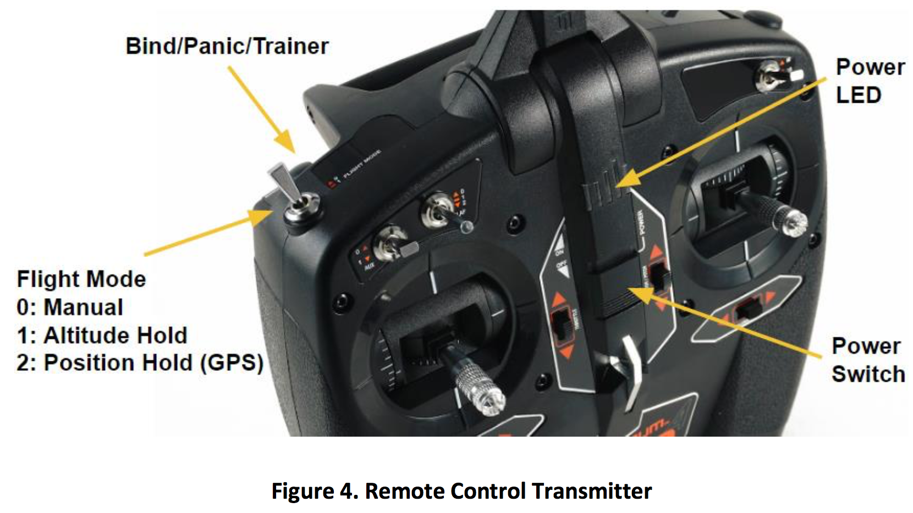

    5. Turn the drone on

3. Prepare to Fly
    1. Perform all pre-flight safety procedures as follows: __Pre-Flight Safety Check.__ Perform this safety check before each flight of the drone (also referred to as UAV). Verify the following:
        1. The flight zone is clear with enough open space outdoors for take-off and landing (no people, animals, or obstacles within a radius of 10 meters).
        2. Propellers are in working condition and attached securely to the motors.
        3. All drone components and wires are securely attached to the airframe and do not impede the path of the
propellers.
        4. The drone battery is properly charged. Connect the battery to the UAV circuitry only when in use.
        5. The drone battery is secured to the airframe.
        6. The battery for the remote control transmitter is properly charged.
        7. Communication between the remote control transmitter and the drone is functioning properly. (step c, below)
        8. __Arm the motors only after people, animals, and obstacles are at a safe distance.__
      __WARNING:__ Check airworthiness of the drone before each flight, especially after any incident like a hard landing. Do not fly the drone if any part of the aircraft appears to be damaged or malfunctioning. Always perform the Pre-Flight Safety Check before each flight.

    2. Turn ON the Drone: Press the power button on the drone (Figure 5) for about 1 second. The two blue LEDs immediately adjacent to the power button will illuminate a steady blue and the cooling fan will spin.

       After turning ON the drone, wait at least 30 seconds before attempting to turn OFF the drone. This includes turning OFF the drone either by pressing the power button or by disconnecting the battery. By waiting for at least 30 seconds, the system should have enough time to load all software components, reducing the risks associated with an unexpected shutdown.

       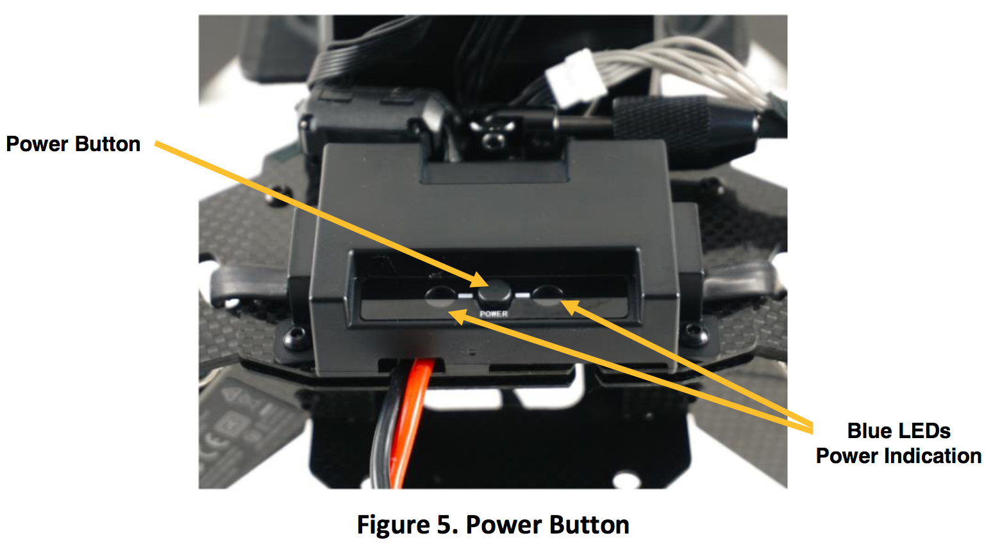

    3. Verify the remote control transmitter is paired to the drone: Verify the orange LED on the remote control receiver located on the bottom side of the drone (Figure 6) is illuminated and steady orange. _If the LED is blinking or not ON, please check the troubleshooting tips._

      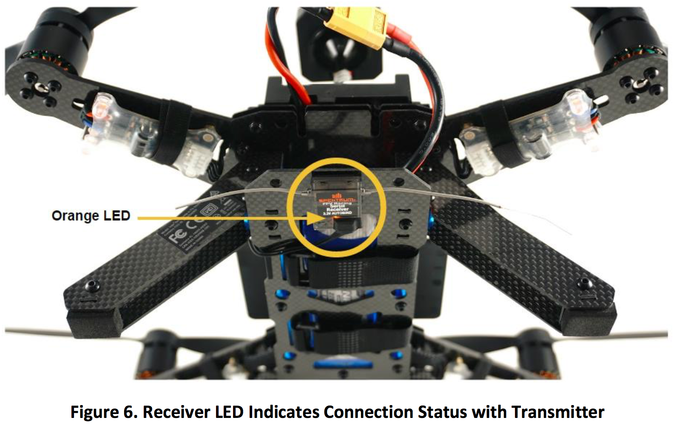

    4. Arming and Disarming the Motors
     The following instructions assume default factory settings. If you modify the Flight Mode configurations, these instructions may not apply.
        1. Press the left gimbal stick toward the bottom right. Hold for about 2 seconds. (Figure 7 ) The motors will start spinning.

         __CAUTION – MOTORS WILL SPIN – STAY CLEAR OF THE PROPELLERS__

         Note: When flying indoors, or areas where there is a weak GPS signal, use Stabilized flight mode (mode 0).

         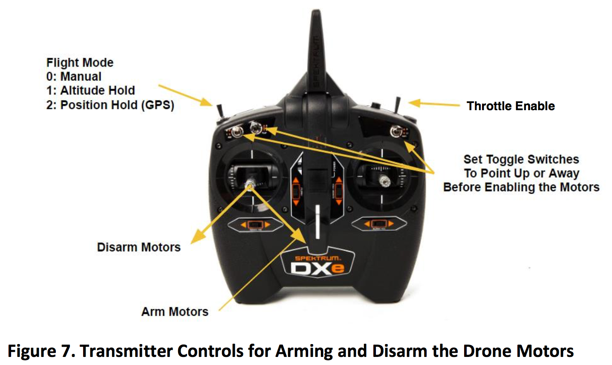

        2. To disarm the motors, press the left gimbal stick toward the bottom left. Hold for about 2 seconds. (Figure 7) The motors will stop spinning.

    5. Choose the appropriate Flight Mode. Mode numbers below correspond to the default mode assignment. Always have a GCS connected and check modes are as expected before flight. QGroundControl is the recommended GCS.
        1. INDOOR FLIGHTS: use __Stabilized__ (mode 0) or __Altitude Hold__ (mode 1).
       _Stabilized flight mode requires reasonable piloting skills. Until you are experienced, use caution while operating in this mode._
        2. OUTDOOR FLIGHTS: use any of the 3 modes: __Stabilized__ (mode 0), __Altitude Hold__ (mode 1) or __Position Hold (GPS)__ (mode 2).
       _It is recommended to use __Position Hold (GPS)__ (mode 2) when flying outdoors for greater flight stability. Note that this mode relies upon the drone locking onto a GPS signal. For best performance, place the drone in an area that has clear line of sight to the sky and wait for 3D lock and low HDOP before attempting to fly in __Position Hold (GPS)__ mode. Connect a GCS to the drone to check everything is ok (see instructions on page 7 “For Developers and Advanced Users” to install and use the QGroundControl application)._

4. Takeoff: Slowly increase throttle by pushing the left gimbal stick upward. When flying in Stabilized flight mode, be especially prepared to compensate for any drift by controlling pitch and roll stick. On __Altitude Hold__ or __Position Hold (GPS)__ the drone will only takeoff after the throttle stick (left one) is more or less above the middle level.

5. Land the Drone
    1. It is easier to land the drone using __Position Hold (GPS)__ flight mode, which allows for a more controlled rate of decent and stability.
    2. Landing safely in __Stabilized__ flight mode requires reasonable piloting skills. Be prepared to control the rate of decent to minimize hard impact with the landing surface.

6. Return to Launch (RTL)
    1. The drone is pre-programmed at the factory to Return to Launch if communication between the remote control transmitter and the drone is lost. RETURN TO LAUNCH is an automated landing procedure that will fly the drone from wherever it is when the transmitter’s signal was lost back to the location from where it first took off, subject to remaining battery power.
    2. You can force this procedure by turning OFF the remote control transmitter while the drone is in flight. Turning ON the transmitter will allow you to regain communications with the drone.
    3. This feature may not be available if you make changes to the Flight Modes programmed at the factory.
    4. Other failsafe options like commanding the drone to land rather than returning to launch can be selected on the GCS

7. Turn OFF / Power Down
    1. Always turn OFF the drone before turning off the transmitter.
    2. Press and hold the power button (Figure 5) on the drone for approximately 3 seconds until the blue LEDs blink rapidly 3 times. This will trigger a graceful shutdown of the Linux OS.
    3. You may now turn OFF the remote control transmitter.

## Troubleshooting

These troubleshooting tips are for basic usage. For additional troubleshooting tips, please visit the Intel Aero Platform Community Support Forum [communities.intel.com/community/tech/intel-aero](https://communities.intel.com/community/tech/intel-aero)

### _The GPS antenna mast cannot be raised 90o (vertical):_

     The antenna hinge may be stiff. Be gentle and apply steady pressure to lift the antenna mast. Be sure to slide the antenna base cover away from the base when attempting to raise the antenna mast so that it does not interfere with the hinge.

### _The orange LED on the remote control receiver is blinking:_

This indicates the remote control transmitter and receiver are not properly bound (paired) or that at any moment after turining the receiver on it lost connection to the trasmitter. This can happen if the receiver is turned on before the transmitter or if they are in fact not bound. To bind the transmitter and receiver, turn ON the transmitter while holding down the black panic/bind/trainer button that is immediately adjacent to the Flight Mode toggle switch on the top-left of the transmitter (see Figure 4). If the binding process is successful, the receiver’s orange LED will have a steady orange glow. The binding may fail if there are other nearby transmitters of the same mode. This binding will be remembered in the future as long as the transmitter is always turned on before the drone is turned on. To avoid having to bind it again when you the RTF was turned on before the transmitter, you can just turn everything off and on again on the correct order. More information on the binding process can be found in the user guide for the [Spektrum SPM4648 DXMX receiver, found online](https://www.spektrumrc.com/ProdInfo/Files/SPM4648-Manual-EN.pdf)

### _The orange LED on the remote control receiver is ON and steady, but the transmitter does not appear to control the receiver:_

It is possible the receiver is bound to a different transmitter. Follow the instructions for binding (pairing) the transmitter and receiver. Please refer to the troubleshooting tip above.

### _The motors do not arm:_

Check if the remote control transmitter and receiver are properly bound (paired). If not, please refer to troubleshooting tip above.

### _The motors arm but the gimbal stick does not control motor throttle:_

Check if the “Throttle Enable” toggle switch on the remote control transmitter is in the “Arm” position. If it is in the “Disarm” position, throttling will have no effect.

### _Pressing and holding the drone’s power button for 3 seconds does not shutdown the drone:_

Disconnect the battery. Wait at least 30 seconds. Then reconnect the battery.

## Common mistakes:

* Turning on RC after the drone
* how to rebind... http://ardupilot.org/copter/docs/common-intel-aero-rtf.html#connecting-the-transmitter
